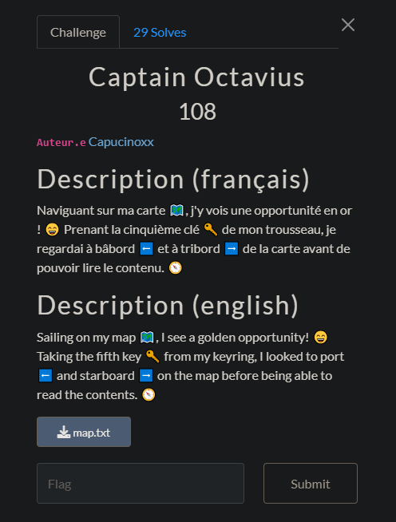

## Captain Octavius


The file contains this text.
```
+------------------------------------------------------------------------------------------------------+
|    #                                                                                         |       |
|                                                                                                      |
|                                                                                                      |
| M8qq5 ymEwJ1 $5zsl xE6q5w3 Ns q6kJ1 s5y J{Jw$ym6sl 6x gJEzy6kzq3 YEpJ ymJ sErJ 5k r$ g5Ey1 ymJ       |
| HmEwq5yyJ [5lzJ R8w$1 k5w 8#EruqJ3 6y,x h8wyE6sq$ qEwlJ1 gzy zLq^3 YmJ KqEl 6x ymJ sErJ 5k ymJ g5Ey3 |
| -qt\8wdhEXj + Fqumfg8y6h 6jyyJw + |6ym5zY xuEh8.                                                     |
|                                                                                                      |
|                                                                                                      |
|                                                                                                      |
+------------------------------------------------------------------------------------------------------+
```
Just looking at the cipher I guessed that it could be a Cesear cipher (repeating words and double letters).
The challenge description also said something about the fifth key (could be the shift).

The cipher has numbers and special symbols so I needed to shift the ascii value of all characters (except spaces).

I came up with this script.

```python
cipher = """M8qq5 ymEwJ1 $5zsl xE6q5w3 Ns q6kJ1 s5y J{Jw$ym6sl 6x gJEzy6kzq3 YEpJ ymJ sErJ 5k r$ g5Ey1 ymJ
HmEwq5yyJ [5lzJ R8w$1 k5w 8#EruqJ3 6y,x h8wyE6sq$ qEwlJ1 gzy zLq^3 YmJ KqEl 6x ymJ sErJ 5k ymJ g5Ey3
-qt\8wdhEXj + Fqumfg8y6h 6jyyJw + |6ym5zY xuEh8."""

message = [chr(ord(x)-5) if ord(x) > 36 else x for x in cipher] #36 is just the sweet spot so the console can print everything

print("".join(message))
```
Giving this next output

```
H3ll0 th@rE, $0ung s@1l0r. In l1fE, n0t EvEr$th1ng 1s bE@ut1ful. T@kE thE n@mE 0f m$ b0@t, thE
Ch@rl0ttE V0guE M3r$, f0r 3#@mplE. 1t's c3rt@1nl$ l@rgE, but uGlY. ThE Fl@g 1s thE n@mE 0f thE b0@t.
(loW3r_c@Se & Alphab3t1c 1ettEr & w1th0uT sp@c3)
```
Reading the instructions and replacing the `$` with `y` gives the flag.

`flag-thecharlottevoguemery`