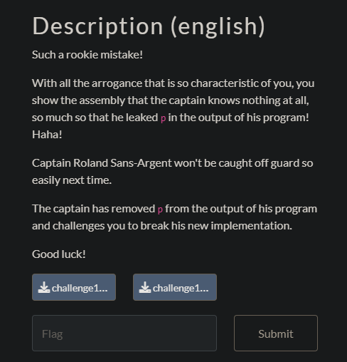

## Rolland Sans-Argent 1/4


We are given this public key

```
Encrypted flag: 8963789834135020795224347902733157530
Public key n: 102812568668937980441364628030483631731
Public key e: 65537
```

n is too small so its factors are probably known.

I found the factors p and q using http://factordb.com then decrypted the flag with the following code.

```python
c = 8963789834135020795224347902733157530
n = 102812568668937980441364628030483631731
e = 65537
p = 9286122387570552467
q = n//p
phi = (p - 1)*(q - 1)

def egcd(a, b):
    if a == 0:
        return (b, 0, 1)
    else:
        g, y, x = egcd(b % a, a)
        return (g, x - (b // a) * y, y)

def modinv(a, m):
    g, x, y = egcd(a, m)
    if g != 1:
        raise Exception('modular inverse does not exist')
    else:
        return x % m

d = modinv(e, phi)
flag = pow(c, d, n)
flag = bytes.fromhex(hex(flag)[2:]).decode()
print(flag)
```

`flag-5oItB3g1n5`