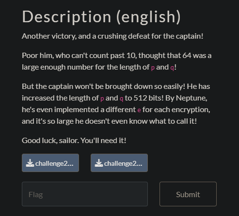

## Rolland Sans-Argent 2/4


We get 2 public keys with a common n and 2 encrypted flags.

```
Encrypted flag with e1: 28689726464471984025059169318232993078460273209886442537464870355974888638991579001316909915559847253642039942889027715458785887921890991685913066623858066692141396439551507135272690248388212221527918351696136808930939577385332643551868515367824945746400992597126260275260567739704458504887250100888625810473
Encrypted flag with e2: 24634677217736560807813188301324517298313799143930696944427747965369289033302366913857008167212275254432873019849491141635221114106968228983207351990636024265662263907972116273086083369173798015942155844255927609366141240071769784268644137652683967545087600740334041265826459874456456744259034149466527145714
Common public key n: 114194021424602852676222775460979397798152619390680654104963537621902451831836470362082297540629391019670245824664746208852579273180992066701163543676800651644862472034165286115837997798371540779457218633396524675029078054172857587631842213823984073019202305126609289686879378066041784553293227296464240835267
Public key e1: 65537
Public key e2: 65539
```

The vulnerability has obviously something to do with the common n but I didn't know what I needed to code.

With a bit of research I found this post with a similar problem https://crypto.stackexchange.com/questions/1614/rsa-cracking-the-same-message-is-sent-to-two-different-people-problem

It says that a plain text message `m` can be found with the formula $m≡c_a^1⋅c_b^2 \bmod n$

We need `e1` and `e2` coprimes though to find `a` and `b`.

The following code gives the flag.

```python
c1 = 28689726464471984025059169318232993078460273209886442537464870355974888638991579001316909915559847253642039942889027715458785887921890991685913066623858066692141396439551507135272690248388212221527918351696136808930939577385332643551868515367824945746400992597126260275260567739704458504887250100888625810473
c2 = 24634677217736560807813188301324517298313799143930696944427747965369289033302366913857008167212275254432873019849491141635221114106968228983207351990636024265662263907972116273086083369173798015942155844255927609366141240071769784268644137652683967545087600740334041265826459874456456744259034149466527145714
n = 114194021424602852676222775460979397798152619390680654104963537621902451831836470362082297540629391019670245824664746208852579273180992066701163543676800651644862472034165286115837997798371540779457218633396524675029078054172857587631842213823984073019202305126609289686879378066041784553293227296464240835267
e1 = 65537
e2 = 65539

def egcd(a, b):
    if a == 0:
        return (b, 0, 1)
    else:
        g, y, x = egcd(b % a, a)
        return (g, x - (b // a) * y, y)

def modinv(a, m):
    g, x, y = egcd(a, m)
    if g != 1:
        raise Exception('modular inverse does not exist')
    else:
        return x % m

x, a, b = egcd(e1, e2)
i = modinv(c2, n) # needed because b is negative
flag = pow(c1, a, n) * pow(i, -b, n) % n
flag = bytes.fromhex(hex(flag)[2:]).decode()
print(flag)
```

`flag-c0primeM0r3l1k3c00lpr1me`