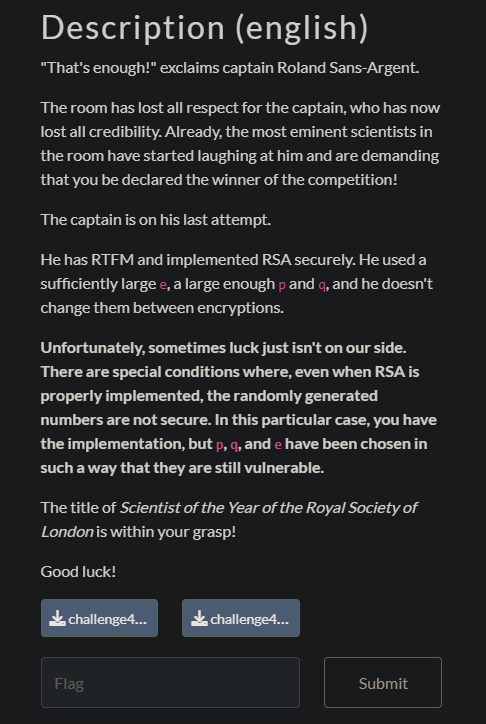

## Rolland Sans-Argent 4/4


Reading the challenge description, we get that it's supposed to be a state of the art RSA implementation. The only odd thing is that the captain got really **unlucky**.

The description refers to the key generation part in particular.

```python
def generate_rsa_keys(e):
    counter = 0
    while True:
        p = getPrime(512)
        q = getPrime(512)

        phi = (p - 1) * (q - 1)

        if GCD(e, phi) == 1:
            n = p * q
            d = inverse(e, phi)
            print("counter is:", counter)
            return (e, n), d
        counter += 1
```

The only way I could see a vulnerability is if `p` and `q` have been chosen really close to each other. It would mean that the square root of `n` would be near those values.

With that assumption, we can get the `n` factors back with the `Fermat's attack`

```python
from math import floor, sqrt
import gmpy2

c = 56008170769554887262576319302940601118185325126886908098084196135436308065377532766072584970927988557945463342052117388311916233341535457277134719836517077918981273317076166502671280138135633782266262824257003537995945302780023802715707789751684451670470443189343490113838854309789410818510249988212513174403
n = 75028926564243095350876556253054002059048724162557616616984189236507249837906571739103341249511617617686728055121809964555365800748123277977503402143848791135583759511900470314822144753821175349989759114593174302727420916174556594489335976199015832911621980456957179023125962485241644610617345637998571255579
e = 65537

def egcd(a, b):
    if a == 0:
        return (b, 0, 1)
    else:
        g, y, x = egcd(b % a, a)
        return (g, x - (b // a) * y, y)

def modinv(a, m):
    g, x, y = egcd(a, m)
    if g != 1:
        raise Exception('modular inverse does not exist')
    else:
        return x % m

def FermatFactor(n: int, max_steps: int):
    if n % 2 == 0:
        return 2, n // 2

    a = gmpy2.isqrt(n)

    if a * a == n:
        return a, a

    a += 1  # ceil(sqrt(n))
    b2 = a * a - n

    for _ in range(max_steps):
        if gmpy2.is_square(b2):
            return a + gmpy2.isqrt(b2), a - gmpy2.isqrt(b2)

    b2 += a
    a += 1
    b2 += a
    return None

p, q = FermatFactor(n, 100)
phi = (p-1)*(q-1)
d = modinv(e, phi)
flag = pow(c, d, n)
flag = bytes.fromhex(hex(flag)[2:]).decode()
print(flag)
```

`flag-50m3t1me5y0uju5tg3tun1ucky`