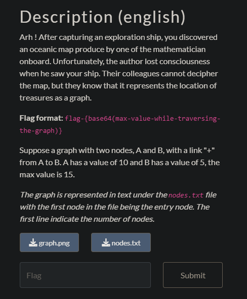

## Carte océanique 1



We need to compute the max total value from a route starting from the node in green.


I wrote the following code to find the flag.

```python
from base64 import b64encode

n_nodes = 21
nodes = []

a="""
543
561
865
123
421
232
654
231
142
453
968
876
567
551
565
214
215
765
323
563
235
""".split()

b="""0 1 +
0 2 +
1 3 +
1 4 +
2 4 +
2 5 +
3 6 +
3 7 +
4 7 +
4 8 +
5 8 +
5 9 +
6 10 +
6 11 +
7 11 +
7 12 +
8 12 +
8 13 +
9 13 +
9 14 +
10 15 +
10 16 +
11 16 +
11 17 +
12 17 +
12 18 +
13 18 +
13 19 +
14 19 +
14 20 +""".split('\n')

SUM = []

class Node:
    def __init__(self, node):
        self.node = node
        self.value = int(a[node])
        self.left = None
        self.right = None
        self.sum = 0

    def set_child(self, node):
        if not self.left:
            self.left = node
        else:
            self.right = node
    
    def get_sum(self, passed_value):
        self.sum = passed_value + self.value
        if not self.left and not self.right:
            SUM.append(self.sum)
        if self.left:
            self.left.get_sum(self.sum)
        if self.right:
            self.right.get_sum(self.sum)

def build_tree():
    for elem in b:
        tmp = [int(x) for x in elem.split()[:2]]
        nodes[tmp[0]].set_child(nodes[tmp[1]])

for i in range(n_nodes):
    nodes.append(Node(i))

build_tree()

nodes[0].get_sum(0)
SUM.sort()
encoded_max_value = b64encode(str(SUM[-1]).encode()).decode('ascii')
print('flag-' + encoded_max_value)
```
`flag-MzcwMQ==`