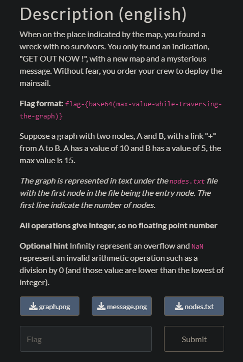

## Carte océanique 3

This time, this rules get added from `message.png`

So neither you can divide by zero or take loops that could increase/decrease a value to ±infinity.

The graph we need to work with :

I removed the link between the node `912452` and `110012` and computed the value with the same script used in the last challenge.

Without a loop in the graph, I got that the route with the max value end in the node with the value `-1` in it.

It makes sense because all other nodes return a negative value. A multiplication by `-1` returns automatically the max value.

I could loop to get larger numbers before ending in the same node, but it would be always possible to get higher values and it's forbidden.

So the highest value we can get is `1499062842352`. This value is then converted in base 64 to get the flag.

`flag-MTQ5OTA2Mjg0MjM1Mg==`