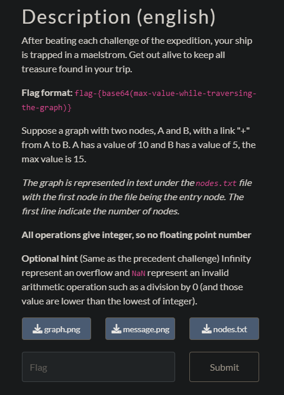

## Carte océanique 4

The same extra rules from *Carte océanique 3* apply to this challenge.

The graph is a bit more complex with more loops.

I took once again the same script I did for *Carte océanique 2* and erased all connections between nodes with illegal operations (division by zero) and nodes leading to loops.

The max value I got was not the flag though.

I kept staring at the graph until something got my attention : The modulo operation `%`

It's means that the max value at the exit of this operation is `22`.

So I tried to end the route with the highest value from a value of 22 but it didn't work either.

I made the wrong assumption that 22 was the max value but looping forever doesn't mean necessarily that the value 22 gets outputted.

So I made I script to compute over 50 loops that print each value after the modulo operation. It turns out that the max value is `20`.

Taking this value and ending the route in the node with the value 7134 in it gives the max value `22195464882`. Converting it in base 64 gets the flag.

`flag-MjIxOTU0NjQ4ODI=`