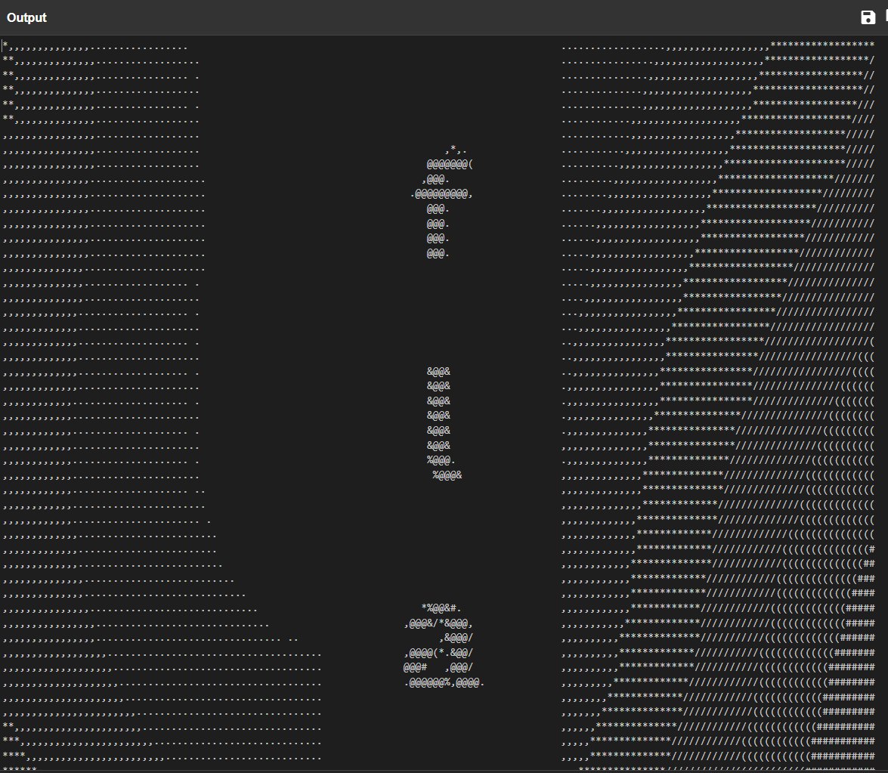

## Lire entre les lignes 1


A glance of the gibberish :

```00101010 00101100 00101100 00101100 00101100 00101100 00101100 00101100 00101100 00101100 00101100 00101100 00101100 00101100 00101100 00101110 00101110 00101110 00101110 00101110 00101110 00101110 00101110 00101110 00101110 00101110 00101110 00101110 00101110 00101110 00101110 00101110 00100000 00100000 00100000 00100000 00100000 00100000 00100000 00100000 00100000 00100000 00100000 00100000 00100000 00100000 00100000 00100000 00100000 00100000 00100000 00100000 00100000 00100000 00100000 00100000 00100000 00100000 00100000 00100000 00100000 00100000 00100000 00100000 00100000 00100000 00100000 00100000 00100000 00100000 00100000 00100000 00100000 00100000 00100000 00100000 00100000 00100000 00100000 00100000 00100000 00100000 00100000 00100000 00100000 00100000 00100000 00100000 00100000 00100000 00100000 00100000 00100000 00100000 00100000 00100000 00101110 00101110 00101110 00101110 00101110 00101110 00101110 00101110 00101110 00101110 00101110 00101110 00101110 00101110 00101110 00101110 00101110 0010111```

Inputing the whole content of the file in https://gchq.github.io/CyberChef/ with the recipe `From Binary` output the flag.

The first part of the output :



`flag-y0u_d1d_n07_3xp3c7_7h4t_h4h4`