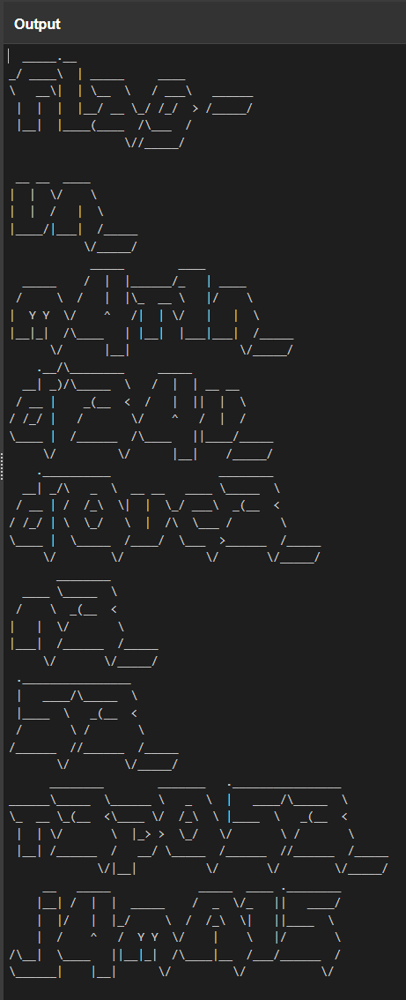

## Lire entre les lignes 2


A glance of the gibberish :

```20 20 5F 5F 5F 5F 5F 2E 5F 5F 20 20 20 20 20 20 20 20 20 20 20 20 20 20 20 20 20 20 20 20 20 20 20 20 20 20 20 20 20 20 20 20 20 20 20 20 20 20 20 20 20 20 20 20 20 20 0A 5F 2F 20 5F 5F 5F 5F 5C 20 20 7C 20 5F 5F 5F 5F 5F 20 20 20 20 20 5F 5F 5F 5F 20 20 20 20 20 20 20 20 20 20 20 20 20 20 20 20 20 20 20 20 20 20 20 20 20 20 20 20 20 20 0A 5C 20 20 20 5F 5F 5C 7C 20 20 7C 20 5C 5F 5F 20 20 5C 20 20 20 2F 20 5F 5F 5F 5C 20 20 20 5F 5F 5F 5F 5F 5F 20 20 20 20 20 20 20 20 20 20 20 20 20 20 20 20 20 20 20 20 0A 20 7C 20 20 7C 20 20 7C 20 20 7C 5F 5F 2F 20 5F 5F 20 5C 5F 2F 20 2F 5F 2F 20 20 3E 20 2F 5F 5F 5F 5F 5F 2F 20 20 20 20 20 20 20 20 20 20 20 20 20 20 20 20 20 20 20 20 0A 20 7C 5F 5F 7C 20 20 7C 5F 5F 5F 5F 28 5F 5F 5F 5F 20 20 2F 5C 5F 5F 5F 20 20 2F 20 20 20 20 20 20 20 20 20 20 20 20 20 20 20 20 20 20 20 20 20 20 20 20 20 20 20 20 20 0A 20 20 20 20 20 20 20 20 20 20 20 20 20 20 20 20 20 5C 2F 2F 5F 5F 5F 5F 5F 2F 20 20 20 20 20 20 20 20 20 20 20 20 20 20 20 20 20 20 20 20 20 20 20 20 20 20 20 20 20 20 0```

Inputing the whole content of the file in https://gchq.github.io/CyberChef/ with the recipe `From Hex` gives that output



`flag-un_m4r1n_d'34u_d0uc3_n3_53_r3p053_j4mA15`