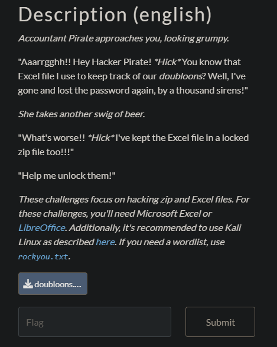

## My Doubloons 1/3




I used John the Ripper to crack the zip file doing the following steps :

1. Create the hash file
```
zip2john doubloons.zip > zip.hash
```
2. Bruteforce the hash file with the popular wordlist rockyou.txt
```
john --wordlist=rockyou.txt zip.hash
```

passwd found : moneypirate

3. Unzip the file with the found password
```
unzip -P moneypirate doubloons.zip
```

The zip archive contains 2 files. One of them is called `flag0.txt` and has the flag written in it.

`flag-j0hnth3d3z1pp3r`