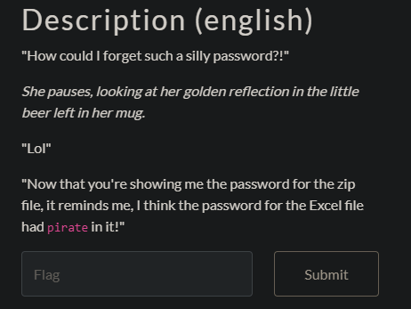

## My Doubloons 2/3




I used John the Ripper to crack the encrypted spreadsheet file we got from the first challenge doing the following steps :

1. Create the hash file
```
office2john my_doubloons.xlsx > office.hash
```
2. I took rockyou.txt and kept only the words containing pirate in them (see the challenge description)
```
grep "pirate" rockyou.txt > pirate.txt
```
Without the filtering, the next command takes too much time to complete.

3. Bruteforce the hash file with our filtered rockyou.txt
```
john --wordlist=pirate.txt office.hash
```

passwd found : i/love/pirates!

4. Open the file with the found password


`flag-d0ntf0rg3ty0urp4ssw0rd`